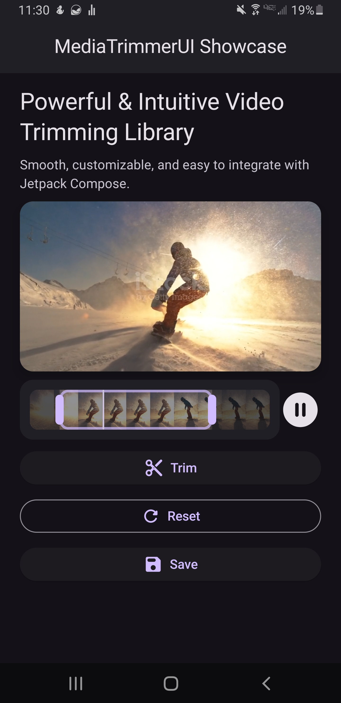

# MediaTrimmer Compose UI 🎬

A lightweight and flexible UI toolkit for trimming **audio** and **video** in Android apps — built entirely with **Jetpack Compose**.

This library provides **only the UI layer**, giving you full control over playback, timing, and processing logic. Whether you're using **ExoPlayer**, **FFmpeg**, or custom media handling, MediaTrimmer UI integrates as the frontend trimming interface.

---

## 🚧 Alpha Notice

> ⚠️ This library is in **early alpha** and not yet production-ready.  
> APIs, behaviors, and performance are subject to change.  
> It has not undergone rigorous testing — feedback and contributions are welcome.

---

## ✨ Features

| Feature                    | Description                                                                 |
|---------------------------|-----------------------------------------------------------------------------|
| 🧱 Compose-native UI       | Built entirely with Jetpack Compose                                         |
| 🔈 Audio + 🎥 Video Support | Works with any media source, visualized through thumbnails or waveform      |
| 🧩 Fully themable          | Customize layout, colors, handles, stroke, and visuals                      |
| 🔗 Playback integration    | Syncs with ExoPlayer or other media engines                                 |
| ⏳ Time-bound Trimming     | Interactive start/end selection with live state updates                     |
| ❌ No media logic enforced | You implement your own trimming backend via FFmpeg or other tools          |

---

## 🚀 Quick Start

For simple audio trimming:

```kotlin
val trimmerState = rememberMediaTrimmerState()

MediaTrimmer(state = trimmerState)
```

To customize visuals, use the `trackContent` slot:

```kotlin
MediaTrimmer(
    state = trimmerState,
    trackContent = {
        MyCustomTrackRenderer(state = trimmerState)
    },
    colors = TrimmerDefaults.colors(
        containerBackgroundColor = MaterialTheme.colorScheme.surface,
        handleColor = Color.Red,
    )
)
```

For video trimming with thumbnails + ExoPlayer:

```kotlin
val player = ExoPlayer.Builder(context).build()
// configure media item...

val trimmerState = rememberMediaTrimmerStateWithPlayer(player)

MediaTrimmer(
    state = trimmerState,
    trackContent = {
        DefaultVideoThumbnails(
            videoUri = yourVideoUri,
            state = trimmerState
        )
    }
)
```

---

## 🖼️ Demo

A full implementation is available inside the project:

👉 [VideoTrimmerDemo.kt](https://github.com/AmjdAlhashede/MediaTrimmerUI/blob/master/app/src/main/java/io/github/mediatrimmer/demo/VideoTrimmerDemo.kt)

> 🎬 Demo video coming soon!

---

### Demo Showcase

Here is how MediaTrimmerUI looks in action:



An intuitive trimming interface synced with ExoPlayer.  
Customize handles, layout, and visuals to fit your app's needs.


## 📦 Installation

Add the dependency to your `build.gradle.kts`:

```kotlin
implementation("io.github.amjdalhashede:mediatrimmer-compose-ui:1.0.0-alpha3")
```

Or with Groovy DSL:

```groovy
implementation 'io.github.amjdalhashede:mediatrimmer-compose-ui:1.0.0-alpha3'
```

---

## ⚠️ Important Notes

- This library **does not perform actual media trimming**.  
  You must implement your own processing logic using FFmpeg, MediaMuxer, or other tools.

- Designed to be **modular and adaptable** for any pipeline or project.

---

## 📜 License

Apache License 2.0  
[See LICENSE file for details](./LICENSE)

---

## 🤝 Contributions

Got ideas, bugs, or improvements?  
Open an issue or pull request and help shape the future of this library.

